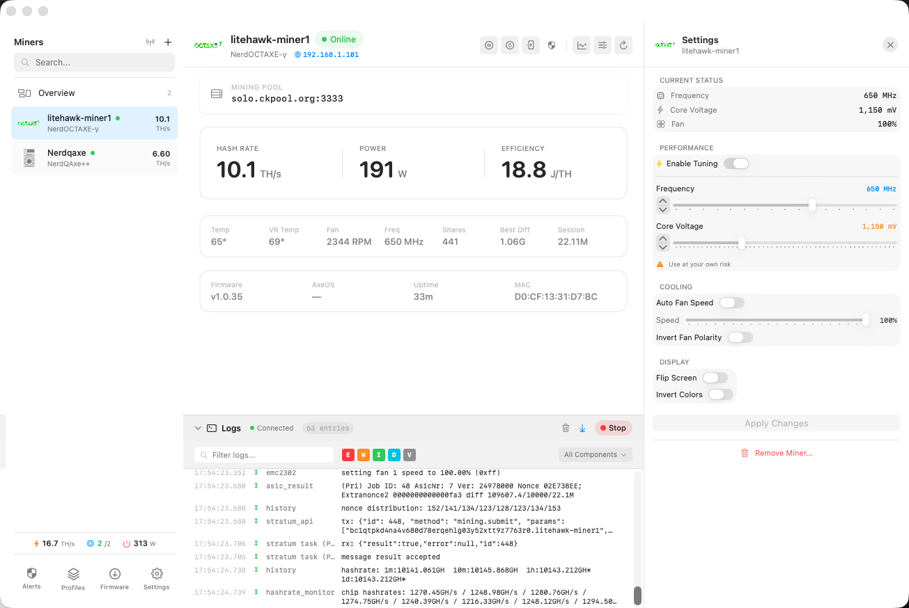
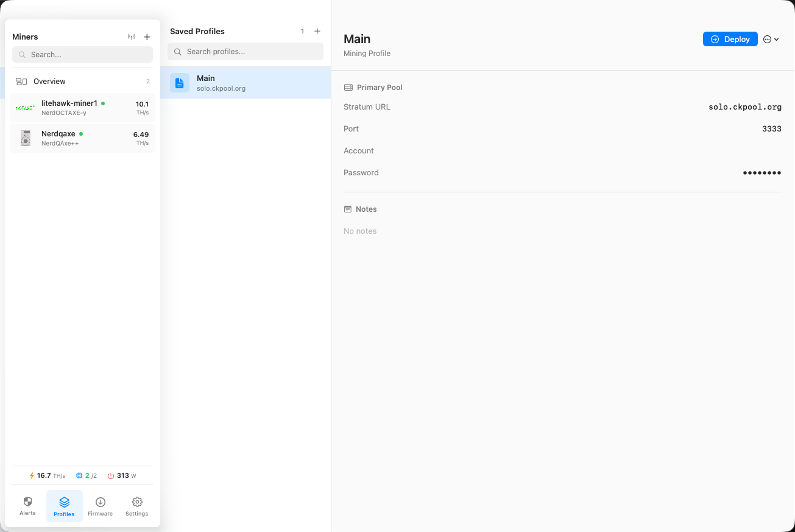
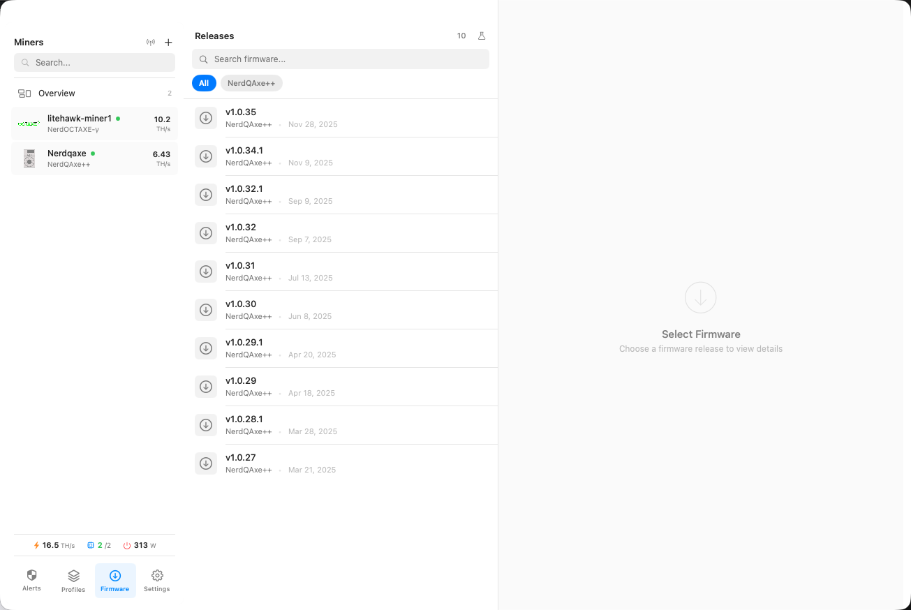
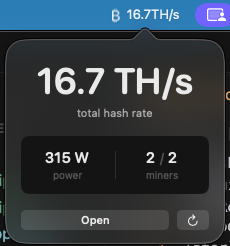
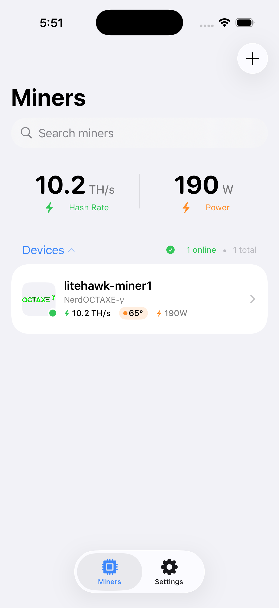
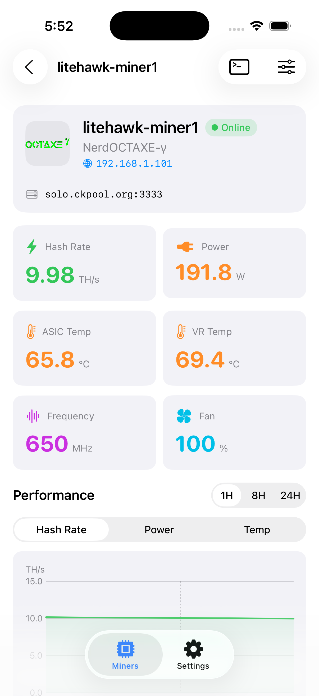
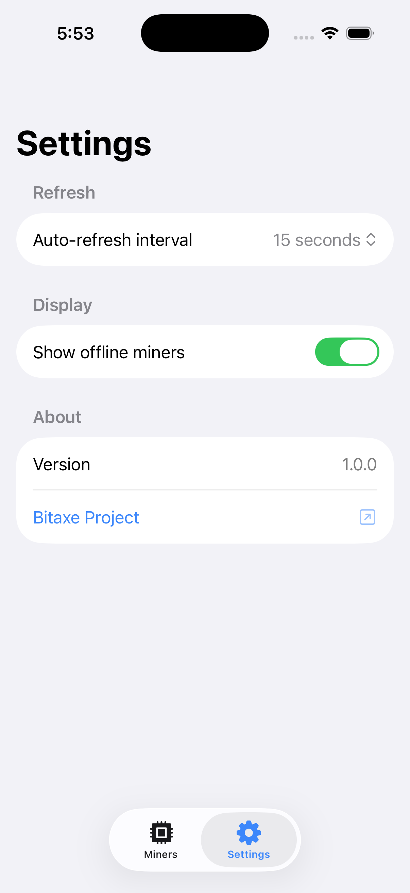
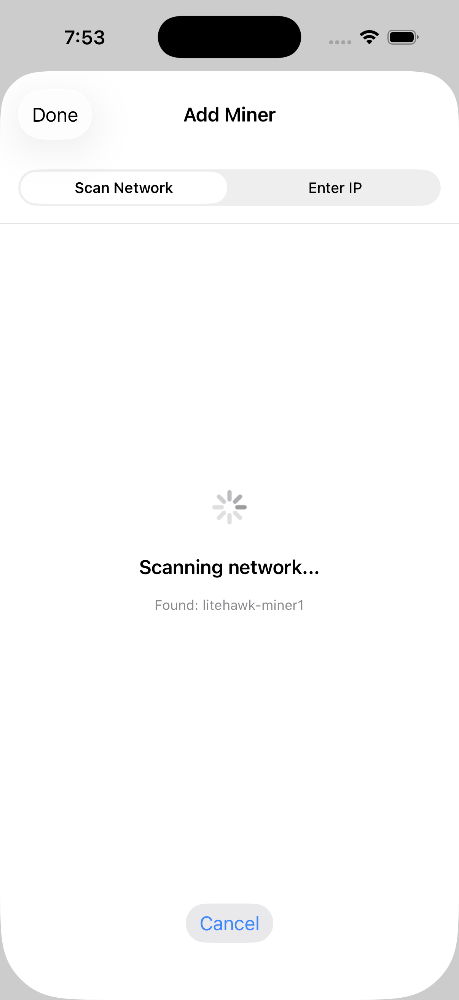
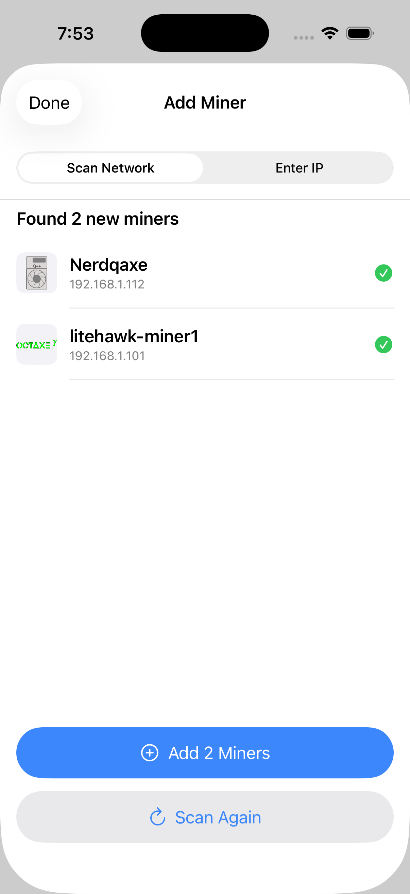
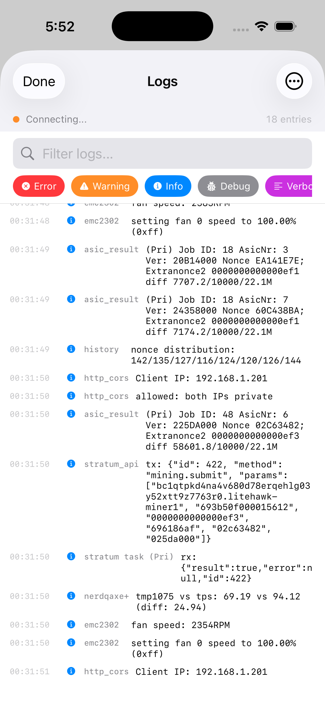

# HashMonitor

Manage your AxeOS-based Bitcoin miners from your Mac or iPhone. Monitor your fleet, deploy configurations, update firmware, and keep your miners hashing.

> **Note:** Requires NerdQAxe miners to run [AxeOS v1.0.30+](https://github.com/shufps/ESP-Miner-NerdQAxePlus/releases/tag/v1.0.30) for MAC address support.

## Platforms

| macOS | iOS |
|-------|-----|
| Full-featured desktop app with profile management, firmware deployment, watchdog, and status bar integration | Mobile companion for on-the-go monitoring, miner configuration, and real-time stats |

Both apps share the same core libraries and communicate directly with your miners over your local network.

## Supported Devices

- Bitaxe Ultra, Supra, Gamma, Gamma Turbo
- NerdQAxe+, NerdQAxe++, NerdOctaxe, NerdQX
- Any AxeOS-compatible miner

## Features

### Both Platforms

- **Network Scanning** — Automatically discover miners on your LAN
- **Real-time Monitoring** — Hash rate, power, temperature, shares
- **Charts** — Historical performance data
- **Live Logs** — WebSocket log streaming with level/component filtering
- **Miner Settings** — Configure frequency, voltage, fan, display, and pool settings

### macOS Only

- **Profile Management** — Save and deploy pool configurations across multiple miners
- **Firmware Deployment** — Download and flash firmware to one or many miners
- **Watchdog** — Auto-restart miners that stop hashing or show power anomalies
- **Status Bar** — Quick glance at aggregate stats from your menu bar

---

## Screenshots

### macOS

<p align="center">
  
</p>

<p align="center">
  
  
</p>

<p align="center">
  
</p>

### iOS

<p align="center">
  
  
  
</p>

<p align="center">
  
  
  
</p>

---

## Building from Source

### Requirements

- Xcode 16+ (macOS 15 Sequoia or later)
- macOS 14+ deployment target
- iOS 17+ deployment target

### macOS App

```bash
open HashRipper.xcworkspace
```

Select **HashRipper > My Mac** as the destination and hit ⌘R to build and run.

### iOS App

```bash
open HashRipper.xcworkspace
```

Select **HashRipper-iOS > iPhone** as the destination and hit ⌘R to build and run.

### Swift Packages

The project includes two shared Swift packages:

- **AxeOSClient** — HTTP and WebSocket client for AxeOS API
- **HashRipperKit** — Shared models (Miner, MinerUpdate, MinerType) and utilities

To run package tests:

```bash
cd libs/AxeOSClient && swift test
cd libs/HashRipperKit && swift test
```

---

## Project Structure

```
HashRipper/
├── app/
│   ├── HashRipper/          # macOS app
│   └── HashRipper-iOS/      # iOS app
├── libs/
│   ├── AxeOSClient/         # Network client package
│   └── HashRipperKit/       # Shared models package
├── icons/                   # Device icon assets
└── HashRipper.xcworkspace   # Combined workspace
```

---

## Credits

Originally created by [Matt Sellars](https://github.com/mattsellars).

## License

This project is licensed under the [GNU General Public License v3.0](LICENSE).
